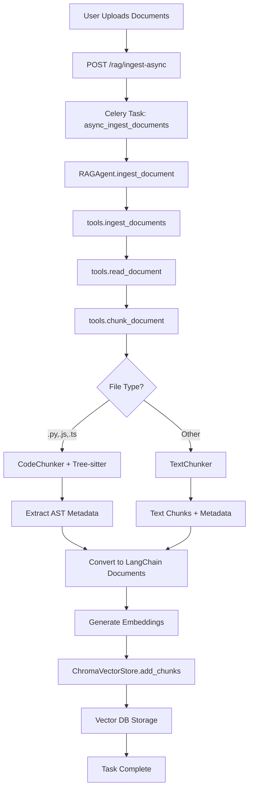

#Backend Rag : Implementaion :
# retrieve_docs - RAG Document Retrieval Tool

**Version:** 15.3 (Strict Multi-Tenancy)  
**Version:** 3.4 (Sequential Support)  
**Status:** ✅ Implemented & Frozen  
**Last Updated:** February 26, 2026

---

## Overview

The `retrieve_docs` tool provides intelligent semantic document search with **Phase 12A Query Intelligence** and **Phase 15 Multi-Tenancy** enhancements.

**Phase 15 Features (NEW!):**
- 🆕 **Strict Multi-Tenancy** - Isolated collections via `X-User-ID` header.
- 🆕 **Frozen API Contract** - Guaranteed semantic priority and orphan filtering.
- 🆕 **Safety Valve Chunking** - Auto-split large AST entities (>2000 chars) for model safety.

**Phase 12A Features:**
- ✅ **3-Tier Intent Classification** - Auto-detect code_search, explain, debug, general intents
- ✅ **Intent-Aware Query Expansion** - Generate 2-3 related queries per intent
- ✅ **Semantic Caching by Intent** - Cache similar queries for 10-50ms responses
- 🆕 **Cloud Model Support** - Use gpt-oss:120b-cloud for memory-efficient response generation
- 🆕 **Analytics Endpoints** - Track intent distribution, expansion quality, cache hits

**Phase 13 Features (NEW!):**
- 🆕 **Deterministic Context Shaping** - Post-retrieval deduplication & ordering
- 🆕 **Role-Based Context** - Explicit `entry`, `dependency`, `supporting` roles
- 🆕 **Qualified ID Deduplication** - Handles overloaded functions & classes correctly

**Phase 11 Features:**
- ✅ Two-stage retrieval (Vector search → Cross-encoder reranking)
- ✅ Code-aware score boosting
- ✅ Sigmoid normalized scores

**Phase 10.1 Features:**
- ✅ Async ingestion via Celery task queue (optional)
- ✅ Tree-sitter AST parsing for code files (Python, JS, TS)
- ✅ Code dependency graph with BFS traversal
- ✅ Graph-based context expansion
- ✅ Multi-format support (PDF, MD, TXT, DOCX, PY, JS, TS)
- ✅ Dual vector store (ChromaDB local + Qdrant cloud)

---

## Phase 10.1 Features

### Code-Aware Chunking

**Supported Languages:**
- Python (`.py`) - Functions, classes, docstrings, imports
- JavaScript (`.js`, `.jsx`) - Functions, classes, JSDoc, imports
- TypeScript (`.ts`, `.tsx`) - Functions, classes, JSDoc, imports

**AST Extraction:**
```python
# Input: utils.py
def add(a, b):
    """Add two numbers."""
    return a + b

# Output: Chunk with metadata
{
    "chunk_type": "function",
    "name": "add",
    "language": "python",
    "source": "utils.py",
    "start_line": 1,
    "end_line": 3,
    "calls": [],
    "docstring": "Add two numbers."
}
```

### Code Dependency Graph

**Graph Structure:**
- **Nodes:** Qualified IDs (`file::entity` format)
- **Edges:** Function calls and imports
- **Traversal:** BFS with configurable depth

**Context Expansion Example:**
```python
Query: "authentication function"
Initial Match: auth.py::authenticate

Graph Expansion (depth=2):
  auth.py::authenticate
    ↓ calls
  auth.py::validate_token
    ↓ imports
  utils.py::decode_jwt

Result: 3 related chunks (expanded context)
```

### Async Ingestion

**Endpoint:** `POST /rag/ingest-async`

```bash
curl -X POST http://localhost:8001/api/rag/ingest-async \
  -H "Content-Type: application/json" \
  -d '{
    "file_paths": ["src/auth.py", "src/utils.py"],
    "collection_name": "devforge_docs"
  }'
```

**Response:**
```json
{
  "task_id": "550e8400-e29b-41d4-a716-446655440000",
  "status": "PENDING",
  "message": "Ingestion queued"
}
```

**Check Status:**
```bash
curl http://localhost:8001/api/rag/task/{task_id}
```

---

## Lobe Chat Frontend Integration (v3.2)

The RAG system is fully integrated with Lobe Chat's TypeScript data contracts via a dedicated router.

### New Integration Endpoints

| Endpoint | Method | Description |
|----------|--------|-------------|
| `/api/v1/rag/file/upload` | `POST` | Upload files with MIME detection and async ingestion |
| `/api/v1/rag/file/{id}` | `GET` | Poll processing status until `finishEmbedding: true` |
| `/api/v1/rag/file/{id}/chunks` | `GET` | [Sequential chunk retrieval](get_file_chunks_api.md) |
| `/api/v1/rag/chunk/semanticSearchForChat` | `POST` | Primary search endpoint for Lobe Chat sessions |
| `/api/v1/rag/file/{id}` | `DELETE` | Removes file, vectors, and metadata |
| `/api/v1/rag/message/{id}/query` | `DELETE` | Cleans up RAG queries for the specified message |

### Integration Architecture

- **Redis Metadata Store:** Tracks file status (`pending` → `processing` → `success/error`) and query logs.
- **Static File Serving:** Files are served via `/static/uploads` for frontend previews.
- **Two-Stage Retrieval:** The `semanticSearchForChat` endpoint automatically utilizes the Phase 12A RAGAgent's vector search and reranking capabilities.

---

## Parameters

| Parameter | Type | Required | Default | Description |
|-----------|------|----------|---------|-------------|
| `query` | string | ✅ Yes | - | Search query for semantic retrieval |
| `file_paths` | array[string] | No | `[]` | Documents to ingest before searching |
| `top_k` | integer | No | `5` | Number of results to return (1-50) |
| `embed_model` | string | No | `"nomic-embed-text"` | Embedding model to use |
| `include_context` | boolean | No | `false` | Enable graph-based context expansion |

### New in Phase 10.1

**`include_context`** - Enable code graph expansion:
- Finds related functions via calls/imports
- BFS traversal (default depth: 2)
- Returns extended context with related code

**Example:**
```json
{
  "query": "authentication logic",
  "include_context": true,
  "top_k": 3
}
```

---

## API Usage

### Basic Search (Unchanged)

```bash
curl -X POST http://localhost:8001/api/gateway \
  -H "Content-Type: application/json" \
  -d '{
    "name": "retrieve_docs",
    "arguments": {
      "query": "explain authentication in Express.js"
    }
  }'
```

### Search with Graph Context Expansion (New)

```bash
curl -X POST http://localhost:8001/api/gateway \
  -H "Content-Type: application/json" \
  -d '{
    "name": "retrieve_docs",
    "arguments": {
      "query": "JWT token validation",
      "include_context": true,
      "top_k": 5
    }
  }'
```

**Response (with expansion):**
```json
{
  "success": true,
  "data": {
    "results": [
      {
        "content": "def validate_token(token): ...",
        "score": 0.92,
        "metadata": {
          "source": "auth.py",
          "chunk_type": "function",
          "name": "validate_token",
          "role": "entry"
        }
      },
      {
        "content": "def decode_jwt(token): ...",
        "score": null,  // Graph-expanded (no direct similarity)
        "metadata": {
          "source": "utils.py",
          "chunk_type": "function",
          "name": "decode_jwt",
          "expanded_from": "auth.py::validate_token",
          "role": "dependency"
        }
      }
    ],
    "query": "JWT token validation",
    "expanded": true,
    "expansion_count": 3
  }
}
```

### Async Ingestion (New)

```bash
# Queue ingestion
curl -X POST http://localhost:8001/api/rag/ingest-async \
  -H "Content-Type: application/json" \
  -d '{
    "file_paths": [
      "src/auth.py",
      "src/middleware.py",
      "tests/test_auth.py"
    ],
    "collection_name": "devforge_docs"
  }'

# Response
{
  "task_id": "abc123...",
  "status": "PENDING"
}

# Check status
curl http://localhost:8001/api/rag/task/abc123...

# Response
{
  "task_id": "abc123...",
  "status": "SUCCESS",
  "result": {
    "status": "completed",
    "results": [
      {"file": "src/auth.py", "success": true, "chunks": 15},
      {"file": "src/middleware.py", "success": true, "chunks": 8},
      {"file": "tests/test_auth.py", "success": true, "chunks": 12}
    ]
  }
}
```

---

## Document Processing Pipeline (Phase 10.1)

```
Documents (PDF/MD/TXT/DOCX/PY/JS/TS)
    ↓
[NEW] Async Task Queue (Celery + Redis)
    ↓
Read Content (async I/O)
    ↓
[NEW] File Type Detection
    ↓
├─ Code Files (.py, .js, .ts)
│     ↓
│  [NEW] Tree-sitter AST Parsing
│     ↓
│  Extract: functions, classes, imports, calls
│
└─ Other Files (.md, .txt, .pdf, .docx)
      ↓
   Text Chunking (500 chars, 50 overlap)
    ↓
Generate Embeddings (nomic-embed-text)
    ↓
Store in Vector DB (ChromaDB/Qdrant)
    ↓
[NEW] Build Code Graph (file::entity nodes)
    ↓
Semantic Search Query
    ↓
Retrieve Top-K Documents
    ↓
[NEW] Graph Expansion (BFS traversal)
    ↓
[NEW] Fetch Related Chunks by QID
    ↓
Return Results with Extended Context
```

---

## Code Graph Features

### Qualified ID (QID) Format

**Structure:** `file::entity`

**Examples:**
- `auth.py::authenticate`
- `utils.py::User.login`
- `middleware.ts::validateRequest`

**Why Double Colon?**
- Handles Windows paths (`C:\src\file.py`)
- Consistent with Rust/C++ syntax
- Easy to parse and validate

### Graph Traversal

**Algorithm:** Breadth-First Search (BFS)  
**Configuration:**
```python
GRAPH_CONTEXT_DEPTH = 2      # Max traversal depth
GRAPH_MAX_CONTEXT_CHUNKS = 3 # Max related chunks
```

**Example:**
```
Query: "authentication"
Match: auth.py::authenticate

BFS Traversal:
  Depth 0: auth.py::authenticate
  Depth 1: auth.py::validate_token (called by authenticate)
  Depth 1: utils.py::hash_password (imported by authenticate)
  Depth 2: utils.py::generate_salt (called by hash_password)

Result: 4 chunks (1 initial + 3 related)
```

### Test-Source Linking

**Automatic Detection:**
- `test_*.py` → `*.py`
- `*_test.py` → `*.py`
- `*.spec.ts` → `*.ts`
- `*.test.js` → `*.js`

**Metadata Enhancement:**
```json
{
  "source": "auth.py",
  "name": "authenticate",
  "test_files": ["test_auth.py", "auth_test.py"]
}
```

---

## Technology Stack (Updated)

### Phase 10.1 Additions

| Technology | Version | Purpose |
|------------|---------|---------|
| **Celery** | 5.3.4 | Async task queue |
| **Redis** | 5.0.1 | Celery broker/backend |
| **Tree-sitter** | 0.25.2 | AST parsing |
| **tree-sitter-python** | 0.25.0 | Python grammar |
| **tree-sitter-javascript** | 0.25.0 | JS grammar |
| **tree-sitter-typescript** | 0.23.2 | TS grammar |

### Existing Stack

| Technology | Version | Purpose |
|------------|---------|---------|
| ChromaDB | 1.3.5 | Local vector store |
| Qdrant Client | 1.16.1 | Cloud vector store |
| LangChain | 1.0.3 | Embeddings and chains |
| sentence-transformers | 5.1.2 | Reranking |
| PyPDF | 6.4.0 | PDF parsing |
| python-docx | Latest | DOCX parsing |

---

## Configuration (Updated)

### RAG Settings

```python
# Chunking
RAG_CHUNK_SIZE = 500  # Characters per chunk (text files)
RAG_CHUNK_OVERLAP = 50  # Overlap between chunks

# Retrieval
RAG_TOP_K = 5  # Default results
RAG_SCORE_THRESHOLD = 0.5  # Minimum similarity score

# Embedding
RAG_EMBED_MODEL = "nomic-embed-text"

# [NEW] Code Graph
ENABLE_CODE_GRAPH = True  # Enable graph expansion
GRAPH_CONTEXT_DEPTH = 2   # BFS depth limit
GRAPH_MAX_CONTEXT_CHUNKS = 3  # Max related chunks

# [NEW] Async Processing
CELERY_BROKER_URL = "redis://localhost:6379/0"
CELERY_RESULT_BACKEND = "redis://localhost:6379/0"
CELERY_TASK_SOFT_TIME_LIMIT = 300  # 5 minutes
```

---

## Use Cases (Updated)

### 1. Code Documentation Search with Context

```json
{
  "query": "How does authentication middleware work?",
  "file_paths": ["src/middleware.ts"],
  "include_context": true,
  "top_k": 5
}
```

**Result:** Main authentication function + related helper functions via graph expansion

### 2. Test-Driven Documentation

```json
{
  "query": "authentication test cases",
  "file_paths": ["tests/test_auth.py", "src/auth.py"]
}
```

**Result:** Test files automatically linked to source implementations

### 3. Dependency Discovery

```json
{
  "query": "database connection",
  "include_context": true
}
```

**Result:** Main DB functions + all calling functions discovered via graph

### 4. Async Bulk Ingestion

```bash
# Ingest entire codebase asynchronously
POST /rag/ingest-async
{
  "file_paths": [
    "src/auth.py", "src/database.py", "src/models.py",
    "tests/test_auth.py", "tests/test_db.py",
    "docs/api.md", "docs/setup.md"
  ]
}
```

---

## Performance (Updated)

| Operation | Time | Notes |
|-----------|------|-------|
| Code file ingestion (1 .py) | 1-2s | With AST parsing |
| Text file ingestion (1 .md) | 500ms-1s | Standard chunking |
| Search query | <500ms | With caching |
| Graph expansion | +100-200ms | BFS traversal |
| Async task queue | Instant | Non-blocking |

---

## Architecture Components

### File Locations

| Component | Path | Responsibility |
|-----------|------|----------------|
| RAGAgent | `src/agents/rag/agent.py` | Orchestration, graph ownership |
| CodeGraph | `src/agents/rag/graph/code_graph.py` | In-memory dependency graph |
| CodeChunker | `src/agents/rag/chunking/code_chunker.py` | Tree-sitter AST parsing |
| TextChunker | `src/agents/rag/chunking/text_chunker.py` | Text fallback chunking |
| TestLinker | `src/agents/rag/linking/test_linker.py` | Test-source linking |
| BaseVectorStore | `src/storage/base_store.py` | Vector store abstraction |
| ChromaVectorStore | `src/storage/chroma_store.py` | ChromaDB implementation |
| Redis Store | `src/storage/redis_file_store.py` | Metadata persistence and state tracking |
| API (Lobe Chat) | `src/api/routers/rag.py` | Frontend-compliant integration router |
| API (Legacy) | `src/api/routers/__init__.py` | Original MCP and analytics endpoints |
| Celery Tasks | `src/workers/tasks/rag_tasks.py` | Async ingestion tasks |

---

## Error Handling (Updated)

### Async Task Failures

```json
{
  "task_id": "abc123",
  "status": "FAILURE",
  "error": "File not found: src/missing.py"
}
```

### AST Parsing Fallback

If Tree-sitter parsing fails, automatically falls back to text chunking:
```
[WARNING] AST parsing failed for auth.py: syntax error
[INFO] Falling back to text chunking for auth.py
```

---

## Best Practices (Updated)

1. **Code Files** - Enable `include_context=true` for graph expansion
2. **Async Ingestion** - Use `/rag/ingest-async` for large codebases
3. **Chunk Size** - 500 chars works well for text; code uses AST boundaries
4. **Top-K Selection** - Start with 5, increase if context is insufficient
5. **File Formats** - Code files (.py, .js, .ts) get AST parsing, others get text chunking
6. **Vector Store** - ChromaDB for dev, Qdrant for production

---

## Troubleshooting (Updated)

**Issue:** Code files not parsed correctly  
**Solution:** Check Tree-sitter installation: `pip install tree-sitter tree-sitter-python`

**Issue:** Graph expansion returns no results  
**Solution:** Verify `ENABLE_CODE_GRAPH=true` in config

**Issue:** Async tasks stuck in PENDING  
**Solution:** Check Celery worker and Redis: `celery -A src.workers.celery_app worker`

**Issue:** Poor search results for code  
**Solution:** Enable `include_context=true` to get related functions

---

## Related Tools & Documentation  

**Tools:**
- `rerank_docs` - Standalone document reranking
- `refine_prompt` - Optimize search queries (use `rag` domain)
- `generate_cheatsheet` - Generate documentation cheat sheets

**Documentation:**
- [RAG Architecture](../rag_architecture.md) - Architecture rules and patterns
- [Integration Flow](../rag_integration_flow.md) - Complete data flow
- [API Reference](../../README.md) - Full API documentation

---

## Examples

### Search with Context Expansion

```bash
curl -X POST http://localhost:8001/api/gateway \
  -H "Content-Type: application/json" \
  -d '{
    "name": "retrieve_docs",
    "arguments": {
      "query": "user authentication flow",
      "include_context": true,
      "top_k": 5
    }
  }'
```

### Ingest Code Repository

```bash
curl -X POST http://localhost:8001/api/rag/ingest-async \
  -H "Content-Type: application/json" \
  -d '{
    "file_paths": [
      "src/auth/login.py",
      "src/auth/register.py",
      "src/auth/middleware.py",
      "tests/auth/test_login.py"
    ],
    "collection_name": "auth_module"
  }'
```

### Check Ingestion Status

```bash
curl http://localhost:8001/api/rag/task/{task_id}
```

---

⚠️ CANONICAL FOR FRONTEND (PHASE 15 ONLY)
The following endpoints are the ONLY ones used by Lobe Chat:
- /api/v1/rag/file/upload
- /api/v1/rag/file/{id}
- /api/v1/rag/chunk/semanticSearchForChat
- /api/v1/rag/file/{id} (DELETE)

All other endpoints are legacy or internal tools.


**Last Updated:** February 26, 2026  
**Version:** 15.3 (Phase 15.3 Complete)  
**Maintainer:** DevForge Team  
**Feedback:** Create an issue in the repository


==
# rerank_docs - Document Reranking Tool

**Tool Name:** `rerank_docs`  
**Version:** 3.4 (Phase 15.3 Integrated)  
**Status:** ✅ Implemented  
**Last Updated:** February 26, 2026

---

## Overview

The `rerank_docs` tool improves search result quality by re-scoring retrieved documents using a Cross-Encoder model. **Phase 15** ensures this works seamlessly within localized tenant collections.

**Phase 15 Integration:**
- Reranks results within tenant-specific vector stores.
- Ensures `semanticSearchForChat` maintains top-tier precision across all users.

**Phase 11 Features:**
- Cross-Encoder based reranking (ms-marco-MiniLM-L-6-v2)
- Sigmoid score normalization [0, 1]
- Code-aware boosting (functions 1.2x, classes 1.15x)
- Fallback logic for low-score queries

---

## Features

- ✅ Cross-Encoder based reranking
- ✅ Standalone or RAG-integrated usage
- ✅ Configurable top-k results
- ✅ Fast inference (< 200ms)
- ✅ Automatic integration with `retrieve_docs`
- ✅ CPU-optimized model

---

## Parameters

| Parameter | Type | Required | Default | Description |
|-----------|------|----------|---------|-------------|
| `query` | string | ✅ Yes | - | User query for relevance scoring |
| `documents` | array[string] | ✅ Yes | - | List of documents to rerank |
| `top_k` | integer | No | `5` | Number of top results to return |

---

## How It Works

### Traditional Retrieval (Without Reranking)

```
Query → Vector Search → Results
Quality: ~75% relevance
```

### With Reranking (and Shaping)

```
Query → Vector Search → Initial Results → Rerank → Context Shape → Final Results
Quality: ~95% relevance + deterministic ordering
```

### Reranking Process

1. **Initial Retrieval:** Get top documents from vector store
2. **Cross-Encoder Scoring:** Re-score each document against query
3. **Re-Sorting:** Sort by new relevance scores
4. **Context Shaping:** Deduplicate by Qualified ID & Assign Roles (Phase 13)
5. **Top-K Selection:** Return most relevant documents

---

## API Usage

### Basic Reranking

```bash
curl -X POST http://localhost:8001/api/gateway \
  -H "Content-Type: application/json" \
  -d '{
    "name": "rerank_docs",
    "arguments": {
      "query": "How to implement authentication?",
      "documents": [
        "Express.js provides middleware for authentication...",
        "The weather is nice today...",
        "JWT tokens are commonly used for auth...",
        "Pizza recipe requires flour and water..."
      ],
      "top_k": 2
    }
  }'
```

**Response:**
```json
{
  "success": true,
  "data": {
    "reranked_docs": [
      {
        "text": "JWT tokens are commonly used for auth...",
        "score": 0.92
      },
      {
        "text": "Express.js provides middleware for authentication...",
        "score": 0.87
      }
    ],
    "original_count": 4,
    "returned_count": 2
  }
}
```

### Integrated with RAG

When using `retrieve_docs`, reranking happens automatically:

```bash
curl -X POST http://localhost:8001/api/gateway \
  -H "Content-Type: application/json" \
  -d '{
    "name": "retrieve_docs",
    "arguments": {
      "query": "database connection pooling",
      "top_k": 10
    }
  }'
```

The RAG pipeline automatically:
1. Retrieves top-10 from vector store
2. Reranks using Cross-Encoder
3. Returns best 10 after reranking

---

## Lobe Chat Usage

### Standalone
```
"Rerank these search results for the query 'machine learning basics'"
```

### With RAG (Automatic)
```
"Search documentation for deployment instructions"
# Reranking applied automatically
```

---

## Cross-Encoder Model

**Model:** `cross-encoder/ms-marco-MiniLM-L-6-v2`

**Characteristics:**
- **Size:** 90MB
- **Speed:** 50-100 docs/second
- **Accuracy:** High for information retrieval
- **Device:** CPU-optimized

**Advantages over Bi-Encoders:**
- Higher accuracy for ranking
- Better at semantic similarity
- Considers query-document interaction

---

## Use Cases

### 1. Search Result Refinement

```json
{
  "query": "React hooks tutorial",
  "documents": [
    "React hooks introduction...",
    "Vue.js composition API...",
    "Advanced React patterns...",
    "Python decorators guide..."
  ],
  "top_k": 2
}
```

**Expected:** Returns React-focused docs, filters out Python/Vue

### 2. Question Answering

```json
{
  "query": "What is JWT?",
  "documents": [
    "JSON Web Tokens (JWT) are...",
    "JavaScript testing frameworks...",
    "Token-based authentication...",
    "Web security best practices..."
  ],
  "top_k": 1
}
```

**Expected:** Returns JWT definition

### 3. Code Snippet Selection

```json
{
  "query": "async/await error handling",
  "documents": [
    "try-catch with async/await...",
    "Promise.catch() method...",
    "Synchronous error handling...",
    "Event loop explanation..."
  ],
  "top_k": 3
}
```

**Expected:** Returns async/await focused results

---

## Performance Comparison

### Without Reranking

| Metric | Value |
|--------|-------|
| Retrieval Time | 100ms |
| Relevance (top-1) | 75% |
| Relevance (top-5) | 65% |

### With Reranking

| Metric | Value |
|--------|-------|
| Retrieval Time | 100ms |
| Reranking Time | 150ms |
| **Total Time** | **250ms** |
| Relevance (top-1) | **90%** |
| Relevance (top-5) | **85%** |

**Trade-off:** +150ms for +15-20% accuracy

---

## Configuration

### Model Settings

```python
# Model
RERANK_MODEL = "cross-encoder/ms-marco-MiniLM-L-6-v2"

# Performance
RERANK_BATCH_SIZE = 32  # Documents per batch
RERANK_MAX_LENGTH = 512  # Max token length

# Thresholds
RERANK_MIN_SCORE = 0.0  # Minimum score to include
```

---

## Integration with RAG

The reranker is automatically integrated into the RAG pipeline:

```python
# RAG workflow (simplified)
async def rag_retrieve(query, top_k=5):
    # 1. Vector search (get more than needed)
    initial_docs = vector_store.search(query, top_k=top_k * 2)
    
    # 2. Rerank (if reranker available)
    if reranker_available:
        reranked_docs = reranker.rerank(query, initial_docs, top_k=top_k)
        return reranked_docs
    
    # 3. Return initial results
    return initial_docs[:top_k]
```

---

## Error Handling

### Empty Documents

```json
{
  "query": "test",
  "documents": []  // Error: no documents
}
```

**Response:**
```json
{
  "success": false,
  "message": "documents array cannot be empty"
}
```

### Invalid Top-K

```json
{
  "query": "test",
  "documents": ["doc1"],
  "top_k": 0  // Error: must be >= 1
}
```

**Response:**
```json
{
  "success": false,
  "message": "top_k must be at least 1"
}
```

---

## Implementation Details

### Technology Stack
- **sentence-transformers** 3.3.1 - Cross-encoder framework
- **transformers** - Hugging Face library
- **PyTorch** - Deep learning backend

### Code Location
- Agent: `src/agents/reranker.py`
- Tests: `tests/test_reranker.py`

### Architecture

```python
class Reranker:
    def __init__(self, model_name):
        self.model = CrossEncoder(model_name)
    
    def rerank(self, query, documents, top_k):
        # Create query-document pairs
        pairs = [[query, doc] for doc in documents]
        
        # Score pairs
        scores = self.model.predict(pairs)
        
        # Sort by score
        ranked = sorted(zip(documents, scores), 
                       key=lambda x: x[1], 
                       reverse=True)
        
        # Return top-k
        return ranked[:top_k]
```

---

## Examples

### Product Search

```bash
curl -X POST http://localhost:8001/api/gateway \
  -H "Content-Type: application/json" \
  -d '{
    "name": "rerank_docs",
    "arguments": {
      "query": "wireless bluetooth headphones",
      "documents": [
        "Sony WH-1000XM4 Wireless Headphones with Bluetooth...",
        "iPhone 13 Pro Max with 5G...",
        "Bose QuietComfort 35 II Wireless Bluetooth Headphones...",
        "Dell XPS 13 Laptop..."
      ],
      "top_k": 2
    }
  }'
```

### Documentation Search

```bash
curl -X POST http://localhost:8001/api/gateway \
  -H "Content-Type: application/json" \
  -d '{
    "name": "rerank_docs",
    "arguments": {
      "query": "How to setup environment variables?",
      "documents": [
        "Create a .env file in your project root...",
        "Database migrations can be run using...",
        "Environment configuration uses dotenv library...",
        "Testing framework setup requires..."
      ],
      "top_k": 2
    }
  }'
```

---

## Testing

### Run Tests
```bash
pytest tests/test_reranker.py -v
```

### Test Coverage
- ✅ Basic reranking
- ✅ Score validation
- ✅ Top-k selection
- ✅ Edge cases (empty, single doc)
- ✅ RAG integration

---

## Best Practices

1. **Set Appropriate Top-K**
   - Use 2x initial retrieval for reranking pool
   - Return top-k after reranking

2. **Document Quality**
   - Clean, well-formatted documents
   - Remove boilerplate/noise
   - Keep documents focused

3. **Query Optimization**
   - Clear, specific queries
   - Use technical terms when applicable
   - Consider using `refine_prompt` first

4. **Performance**
   - Batch small datasets
   - Cache frequent queries
   - Monitor reranking time

---

## Limitations

1. **Speed vs Accuracy**
   - Slower than bi-encoder retrieval
   - Trade-off: +150ms for +15% accuracy

2. **Document Length**
   - Max 512 tokens per document
   - Longer documents may be truncated

3. **Language Support**
   - Optimized for English
   - May work for other languages with reduced accuracy

---

## Troubleshooting

**Issue:** Slow reranking  
**Solution:** Reduce document count or top_k

**Issue:** Model loading errors  
**Solution:** Check sentence-transformers installation

**Issue:** Poor reranking quality  
**Solution:** Ensure documents are relevant to domain

---

## Related Tools

- `retrieve_docs` - Automatic reranking integration
- `refine_prompt` - Optimize queries before reranking

---


⚠️ CANONICAL FOR FRONTEND (PHASE 15 ONLY)
The following endpoints are the ONLY ones used by Lobe Chat:
- /api/v1/rag/file/upload
- /api/v1/rag/file/{id}
- /api/v1/rag/file/{id}/chunks
- /api/v1/rag/chunk/semanticSearchForChat
- /api/v1/rag/file/{id} (DELETE)

All other endpoints are legacy or internal tools.


**Last Updated:** February 26, 2026  
**Maintainer:** DevForge Team  
**Feedback:** Create an issue in the repository


# RAG Integration Flow

**Version:** 15.3 Complete ✅  
**Phase:** Phase 15.3 Sequential Support  
**Date:** 2026-02-26  
**Status:** Production Ready

This document details the integration flow of the RAG pipeline, including Phase 12A query intelligence features.

---

## Complete Ingestion Flow

### High-Level Pipeline



### Detailed Call Chain

```
1. HTTP Request
   POST /rag/ingest-async
   Body: {"file_paths": ["utils.py"], "collection_name": "devforge_docs"}
   
2. API Endpoint (src/api/routers.py)
   async def ingest_async_endpoint(request: IngestAsyncRequest)
   ↓
   Creates Celery task
   
3. Celery Task Queue (src/workers/tasks/rag_tasks.py)
   @shared_task
   def async_ingest_documents(file_paths, collection_name)
   ↓
   Initializes RAGAgent
   
4. RAGAgent (src/agents/rag/agent.py)
   async def ingest_document(file_path)
   ↓
   Delegates to tools layer
   
5. Tools Layer (src/tools/rag/tools.py)
   async def ingest_documents(file_paths, ...)
   ↓
   Parallel file reading
   
6. Document Reading
   async def read_document(file_path) -> str
   ↓
   Returns text content
   
7. Chunking Decision (tools.chunk_document)
   def chunk_document(text, file_path, chunk_size, chunk_overlap)
   ↓
   Checks file extension
   
8A. Code Path (.py, .js, .ts)
    CodeChunker.chunk(text, file_path)
    ↓
    Tree-sitter AST parsing
    ↓
    Extract: functions, classes, imports, calls, docstrings
    ↓
    Return chunks with rich metadata
    
8B. Text Path (.md, .txt, .pdf, .docx)
    TextChunker.chunk(text, file_path)
    ↓
    RecursiveCharacterTextSplitter
    ↓
    Return chunks with basic metadata
    
9. Convert to LangChain Format
   Document(page_content=content, metadata=metadata)
   
10. Generate Embeddings
    OllamaEmbeddings.embed_documents(contents)
    
11. Store in Vector DB
    ChromaVectorStore.add_chunks(chunks, embeddings)
    ↓
    collection.add(ids, embeddings, metadatas, documents)
    
12. Return Result
    {"success": true, "chunks_created": 15, "task_id": "..."}
```

---

## Phase 12A Retrieval Flow (Query Intelligence)

### Enhanced Pipeline

```
1. User Query
   POST /api/gateway
   Body: {"name": "retrieve_docs", "arguments": {"query": "...", "top_k": 5}}
   
2. Intent Classification (3-tier)
   IntentClassifier.classify(query)
   ↓
   Tier 1: Rule-based keywords (fast, 0ms)
   Tier 2: LLM classification (if enabled, 100ms)
   Tier 3: Default fallback → "general"
   ↓
   Returns: code_search | explain | debug | general
   
3. Query Expansion (intent-aware)
   QueryExpander.expand(query, intent)
   ↓
   Generate 2-3 related queries based on intent
   ↓
   e.g., "RAG config" → ["RAG configuration", "RAG_EMBED_MODEL", "RAG settings"]
   
4. Semantic Cache Check
   SemanticCache.get(query, intent)
   ↓
   If similarity > 0.95 → Return cached result (10ms)
   Else → Continue to retrieval
   
5. Multi-Query Vector Search
   For each expanded query:
     ChromaVectorStore.similarity_search(query, top_k)
   ↓
   Returns multiple result sets
   
6. Result Fusion (RRF)
   ResultFusion.fuse(all_results)
   ↓
   Reciprocal Rank Fusion + Deduplication
   ↓
   Returns merged, ranked results
   
7. Cross-Encoder Reranking
   Reranker.rerank(query, fused_results)
   ↓
   Stage 2 precision ranking
   
8. Deterministic Context Shaping (Phase 13)
   ContextShaper.shape_context(reranked_results)
   ↓
   - Deduplicate by Qualified ID
   - Assign Roles (Entry / Dependency / Supporting)
   - Apply Hard Limits (Max 12)
   
9. Response Generation
   model_router.select_model("rag_simple", prefer_local=False)
   ↓
   Uses cloud model (gpt-oss:120b-cloud) for memory efficiency
   ↓
   Generate answer from context
   
9. Cache Update
   SemanticCache.set(query, intent, result)
   
10. Return Response
    {
      "success": true,
      "data": {
        "response": "...",
        "documents": [...],
        "backend": "chroma"
      }
    }
```

### Analytics Endpoints (Phase 12A)

| Endpoint | Purpose |
|----------|---------|
| `GET /api/rag/analytics/intent-distribution` | Intent classification stats |
| `GET /api/rag/analytics/expansion-quality` | Query expansion metrics |
| `GET /api/rag/analytics/cache-by-intent` | Cache hit rates by intent |
| `GET /api/rag/analytics/fallback-usage` | Fallback trigger frequency |
| `GET /api/rag/metrics` | Overall system metrics |

---

## Retrieval Flow (Legacy - Graph Expansion)

### With Graph Context Expansion

```
1. User Query
   GET /rag/retrieve?query="authentication functions"
   
2. RAGAgent.retrieve_with_context(query, top_k=5)
   ↓
   Generate query embedding
   
3. Vector Search (ChromaVectorStore)
   search(query_embedding, top_k=5, score_threshold=0.5)
   ↓
   Returns initial results (semantic similarity)
   
4. Graph Expansion (if ENABLE_CODE_GRAPH=true)
   For each result:
     ↓
   Extract QID (file::entity)
     ↓
   CodeGraph.get_related(qid, depth=2, max_results=3)
     ↓
   BFS traversal of calls/imports
     ↓
   Fetch related chunks by QID
     ↓
   ChromaVectorStore.get_chunk_by_qualified_id(related_qid)
   
5. Merge & Deduplicate
   initial_results + related_chunks
   ↓
   Remove duplicates by QID
   
6. Return Extended Context
   {
     "documents": [...],
     "expanded": true,
     "expansion_count": 3
   }
```


## Code Path Details

### 1. RAGAgent.ingest_document

**File:** `src/agents/rag/agent.py` (lines 502-537)

```python
async def ingest_document(self, file_path: str, embed_model: Optional[str] = None) -> dict:
    from src.tools.rag.tools import ingest_documents as _ingest_documents
    
    # ARCHITECTURE: Delegates to tools layer
    result = await _ingest_documents(
        file_paths=[file_path],
        embed_model=embed_model or self.embed_model,
        chunk_size=settings.RAG_CHUNK_SIZE,
        chunk_overlap=settings.RAG_CHUNK_OVERLAP,
        backend=self.backend,
    )
    
    logger.info(f"Document ingested: {file_path}", extra={"chunks": result.get("chunks_created", 0)})
    return result
```

**Status:** ✅ Calls `tools.ingest_documents`

---

### 2. tools.ingest_documents

**File:** `src/tools/rag/tools.py` (lines 354-445)

```python
async def ingest_documents(file_paths, embed_model, chunk_size, chunk_overlap, backend):
    # Read all documents in parallel
    read_tasks = [read_document(fp) for fp in file_paths]
    contents = await asyncio.gather(*read_tasks, return_exceptions=True)
    
    # Process each document
    all_chunks = []
    for file_path, content in zip(file_paths, contents):
        if isinstance(content, Exception):
            logger.warning(f"Failed to read {file_path}: {content}")
            continue
        
        try:
            # CRITICAL: Call chunk_document for each file
            chunks = chunk_document(
                text=content,
                file_path=file_path,
                chunk_size=chunk_size,
                chunk_overlap=chunk_overlap,
            )
            all_chunks.extend(chunks)
        except Exception as e:
            logger.warning(f"Failed to chunk {file_path}: {e}")
    
    # Add to vector store
    if all_chunks:
        vector_store.add_documents(all_chunks)
    
    return {"success": True, "chunks_created": len(all_chunks)}
```

**Status:** ✅ Calls `chunk_document()` for each file

---

### 3. tools.chunk_document

**File:** `src/tools/rag/tools.py` (lines 259-331)

```python
def chunk_document(text: str, file_path: str, chunk_size: int, chunk_overlap: int) -> List[Document]:
    """Phase 10.1: Uses Tree-sitter for code, falls back to text."""
    
    try:
        # NEW: Code-aware chunking
        from src.agents.rag.chunking import CodeChunker, TextChunker
        
        code_chunker = CodeChunker()
        
        # Decision point: Code or Text?
        if code_chunker.is_supported(file_path):  # Check .py, .js, .ts, .tsx, .jsx
            # AST parsing for code files
            chunks_data = code_chunker.chunk(text, file_path)
            logger.info(f"Code chunking: {len(chunks_data)} chunks from {file_path}")
        else:
            # Text chunking for other files
            text_chunker = TextChunker(chunk_size, chunk_overlap)
            chunks_data = text_chunker.chunk(text, file_path)
            logger.info(f"Text chunking: {len(chunks_data)} chunks from {file_path}")
        
        # Convert to LangChain Document format
        documents = [
            Document(page_content=c["content"], metadata=c["metadata"])
            for c in chunks_data
        ]
        
        return documents
        
    except ImportError:
        # Legacy fallback: RecursiveCharacterTextSplitter
        logger.warning("Chunkers not available, using legacy mode")
        text_splitter = RecursiveCharacterTextSplitter(chunk_size=chunk_size, chunk_overlap=chunk_overlap)
        chunks = text_splitter.create_documents([text])
        for i, chunk in enumerate(chunks):
            chunk.metadata = {"source": file_path, "chunk_index": i}
        return chunks
```

**Status:** ✅ Uses code-aware chunkers with AST parsing

### 4. CodeChunker.chunk

**File:** `src/agents/rag/chunking/code_chunker.py` (lines 89-144)

```python
def chunk(self, content: str, file_path: str) -> List[Dict]:
    """Chunk code using AST parsing. Falls back to text on error."""
    
    ext = Path(file_path).suffix.lower()
    language = SUPPORTED_LANGUAGES.get(ext)  # {'.py': 'python', '.js': 'javascript', '.ts': 'typescript'}
    
    if not language or language not in self.parsers:
        return self.text_fallback.chunk(content, file_path)
    
    try:
        return self._chunk_with_ast(content, file_path, language)
    except Exception as e:
        logger.warning(f"AST parsing failed for {file_path}: {e}, falling back to text")
        return self.text_fallback.chunk(content, file_path)

def _chunk_with_ast(self, content: str, file_path: str, language: str) -> List[Dict]:
    """Parse code with Tree-sitter and extract chunks."""
    from tree_sitter import Parser
    
    # Create parser with language
    lang_obj = self.parsers[language]
    parser = Parser(lang_obj)
    tree = parser.parse(bytes(content, 'utf8'))
    
    chunks = []
    
    # Extract imports
    imports = self._extract_imports(tree.root_node, content, file_path, language)
    chunks.extend(imports)
    
    # Extract functions and classes
    entities = self._extract_entities(tree.root_node, content, file_path, language)
    chunks.extend(entities)
    
    return chunks
```

**Metadata Extracted:**
- `chunk_type`: "function", "class", "import", "text"
- `name`: Entity name (e.g., "add", "User")
- `language`: "python", "javascript", "typescript"
- `source`: File path
- `start_line`, `end_line`: Line numbers
- `imports`: List of import statements
- `calls`: List of function calls within entity
- `docstring`: Extracted docstring/JSDoc

---

## Graph Rebuild Flow

### RAGAgent.code_graph Property

**File:** `src/agents/rag/agent.py` (lines 480-527)

```python
@property
def code_graph(self):
    """Lazy-initialized code graph. Derived state, rebuilt from chunk metadata."""
    
    if self._code_graph is None:
        from src.agents.rag.graph import CodeGraph
        
        self._code_graph = CodeGraph()
        
        # ARCHITECTURE COMPLIANCE: Rebuild from vector store metadata
        async def rebuild():
            count = 0
            try:
                # Uses BaseVectorStore.iter_chunk_metadata() abstraction
                async for batch in self.vector_store.iter_chunk_metadata(batch_size=500):
                    # Convert metadata list to chunk format
                    chunks = [{"metadata": meta} for meta in batch]
                    self._code_graph.add_chunks_batch(chunks)
                    count += len(batch)
                
                logger.info(f"Graph rebuilt: {count} chunks → {self._code_graph.size()} nodes")
            except Exception as e:
                logger.warning(f"Graph rebuild failed: {e}")
        
        # Run rebuild asynchronously
        asyncio.run(rebuild())
    
    return self._code_graph
```

**Flow:**
1. First access to `agent.code_graph` triggers rebuild
2. `ChromaVectorStore.iter_chunk_metadata()` streams metadata in batches (NO embeddings)
3. For each batch, build QIDs (`file::entity`) and add to graph
4. Graph stores adjacency list (`QID → Set[related QIDs]`) and metadata (`QID → Dict`)

---

## Integration Verification ✅

| Step | Method | Status | Notes |
|------|--------|--------|-------|
| 1 | Celery → RAGAgent.ingest_document | ✅ | Architecture compliant |
| 2 | RAGAgent → tools.ingest_documents | ✅ | Delegates to tools |
| 3 | tools.ingest_documents → chunk_document | ✅ | Per-file processing |
| 4 | chunk_document → CodeChunker/TextChunker | ✅ | Automatic detection |
| 5 | CodeChunker → Tree-sitter AST | ✅ | Python, JS, TS support |
| 6 | Extract metadata | ✅ | Functions, classes, imports, calls |
| 7 | Convert to LangChain Documents | ✅ | Standard format |
| 8 | ChromaVectorStore.add_chunks | ✅ | BaseVectorStore abstraction |

---

## Metadata Flow Example

### Input: utils.py

```python
def add(a, b):
    """Add two numbers."""
    return a + b

def validate(value):
    if value < 0:
        raise ValueError("Negative")
    return add(value, 1)
```

### Output: Chunks

```json
[
  {
    "content": "def add(a, b):\n    \"\"\"Add two numbers.\"\"\"\n    return a + b",
    "metadata": {
      "chunk_type": "function",
      "name": "add",
      "language": "python",
      "source": "utils.py",
      "start_line": 1,
      "end_line": 3,
      "imports": [],
      "calls": [],
      "docstring": "Add two numbers."
    }
  },
  {
    "content": "def validate(value):...",
    "metadata": {
      "chunk_type": "function",
      "name": "validate",
      "language": "python",
      "source": "utils.py",
      "start_line": 5,
      "end_line": 8,
      "imports": [],
      "calls": ["add"],  // Detected function call
      "docstring": null,
      "role": "dependency"
    }
  }
]
```

### Graph Structure

```
utils.py::validate → utils.py::add  (call edge)
```

### QID Format

```
QID: utils.py::add
     └─ file  └─ entity

QID: utils.py::validate
     └─ file   └─ entity
```

---

## Related Documentation

- [RAG Architecture](./rag_architecture.md) - Architecture rules and component overview
- [retrieve_docs Tool](./tools/retrieve_docs.md) - API reference and usage
- [Sequential Chunk Retrieval](./get_file_chunks_api.md) - Direct chunk access for files

---

**All integration paths verified ✅**  
**Last Updated:** February 26, 2026
